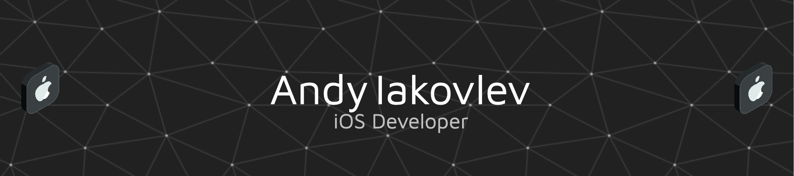

Hi! I'm Andy, an iOS developer.

📑 Here's my latest [résumé](https://drive.proton.me/urls/A4Y493VZVC#98dDNvhDHphZ) if you're hiring.

# 📖 Latest Blog posts

<!-- QSTRND_FEED:START -->
- [Fighting Fraud on iOS with Apple DeviceCheck](https://iakovlev.blog/posts/fighting-fraud-on-ios-with-apple-devicecheck/)
- [Effective Learning](https://iakovlev.blog/posts/effective-learning/)
- [Geeky macOS Setup for Productivity](https://iakovlev.blog/posts/geeky-macos-setup-for-productivity/)
- [Short Introduction](https://iakovlev.blog/posts/why-i-write-this-blog/)
<!-- QSTRND_FEED:END -->

<!-- # ⚙️ Stats

  

 -->